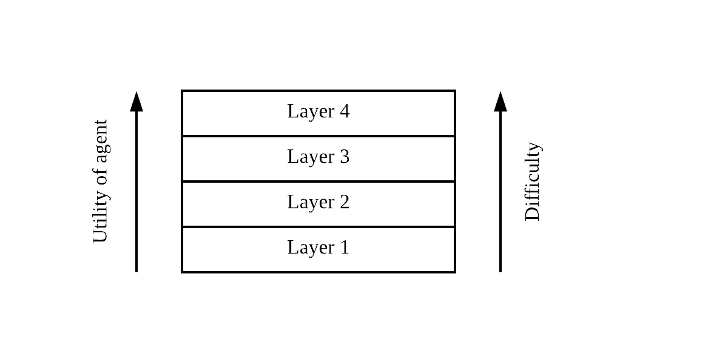
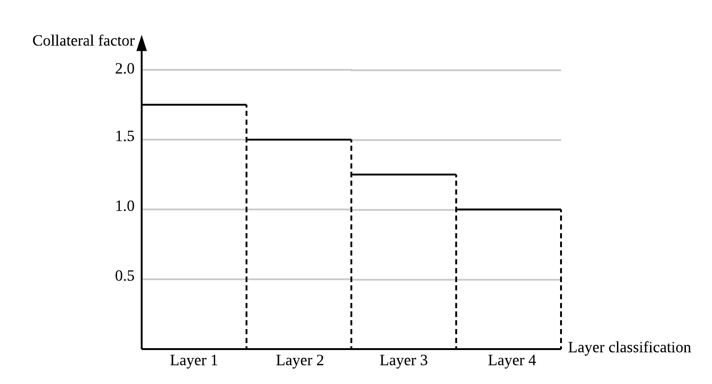

<!--
 Copyright (c) 2019 Dominik Harz
 
 This software is released under the MIT License.
 https://opensource.org/licenses/MIT
-->

# Dynamic Collateral Adjustments

We are introducing a mechanism to dynamically adjust collateral in the case of external events depending on the contributions of agents towards a cryptoeconomic layer 2 protocol. The mechanism design philosophy is borrowed from [Layered Token Curated Registry (TCR)](https://blog.oceanprotocol.com/the-layered-tcr-56cc5b4cdc45). However, we make significant changes to the idea of the registry. The idea is that agents are assigned to layers based on their actions, which in turn determine the amount of collateral they have to provide. The more "desired" actions an agent performs, the less collateral the agent has to provide to participate in the cryptoeconomic layer 2 protocol.


## Problem

Layer 2 protocols on Ethereum typically use collateral to prevent agents to misbehave.
This includes for example Plasma, payment channels (Raiden, PERUN), verifiable computation (TrueBit) or cross-chain protocols like XClaim.
There are two problems with the current approach to collateral in Layer 2 protocols:

- **Dependency on outside events**: The amount of collateral provided is constant for some time period `t`. In case of outside events, there exists no incentive to update the collateral. 
- **Over-collateralisation**: Outside events can occur at any time. Hence, the collateral needs to take any future events into account and needs to be higher in anticipation of such events.

## Layered TCR

The idea of a Layered TCR (LTCR) is to assign agents into layers based on their actions.
A cryptoeconomic protocols has in an abstract sense a list of desired and undesired actions.
In case an agent performs an undesired action, the action is usually "slashed", i.e. its collateral is destroyed or the "victim" of the undesired action is refunded with that collateral. 
Contrary, if the agent performs a desired action, it is usually rewarded with a fee that the consumer of the service is paying (e.g. a solver in TrueBit). 
However, this is a black an white option.

### Basic feedback mechanism 
*What if we could make use of this action classification to build a feedback mechanism?*

Assume you are receiving points as an agent if you perform agents that are part of the desired actions.
The smart contract implementing the protocol is aware of all these actions.
Thereby, the agents actions are directly translated into a ranking (i.e. a layer).

The more contributions the higher the ranking. The higher the ranking, the less collateral the agent has to provide.
We end up with a construct like this:



We need to define a minimum base-line for the collateral for the highest layer. This needs to be equivalent with the minimum collateral accepted by the protocol. However, this can be set with a minimum or no additional safety collateral. We would have a structure like:



These functions solve the problem of over-collateralisation. Agents that contribute to the protocol require less additional collateral. To summarize:

- Collateral can be set according to layers. This will be defined in a smart contract that implements the LTCR.
- The cryptoeconomic protocol votes on the agents rank as the agents performs actions within the protocol.

### Concerning outside events
*What happens if an outside event occurs and the collateral becomes to small?*

Let's extend the mechanism.
We can define additional actions an agent can fulfil relating to the collateral.
If an outside event requires to increase the collateral, we can demand agents to increase their collateral.
If agents are performing this action, they receive additional points.
if they are not performing this, they receive negative points.

To summarize:

- Outside events can trigger the demand for special actions that require the agents to increase their collateral. Fulfilling this request brings points. Refusal deducts points. 

### Periodic updates to the registry
**How are agents sorted into layers?**

The LTCR smart contract maintains the registry.
Agents can collect points that determine if they:

1. Stay in the same layer.
2. Get promoted into the next layer.
3. Get demoted to the previous layer.
4. Get removed from the registry.

The idea is to set a fixed amount of time or events in which agents can collect these points.
At `t_0`, each agent starts with 0 points. Each layer defines a lower and upper bound.
If an agent manages to collect enough points to make the cut of the *current* layer (its upper bound), then the agent gets promoted to that layer at `t_1`. If the agent falls below the lower bound of the *current* layer, it gets demoted to the previous layer.
At the end of the period, scores are reset and the agent starts from 0 again.

To summarize:

- Over a period `t` agents perform actions that can receive points. Those are recorded in the LTCR. 
- At the end of the period, agents can be promoted to the next layer, stay in the same layer, or get demoted to the previous layer.
- At the end of the period, scores are set to 0 for every agent.

## Desired properties

We have a couple of desired properties:

- Rational agents should be motivated to make it to the highest layer.
- Each layer should build an incentive for different types of agents (ones with small, medium, and high collateral exposure).
- Collateral update actions should be strongly incentivised. This should in most cases allow a promotion to the next level. Problem: who controls these events?
- This mechanism has an inherent assumption: unused collateral can be used to provide more services that bring in additional revenue.
- ...?

## Open questions

- What are the parameters that we need to check an verify?
  - Utility functions
  - Interest on collateral
  - Number of agents
  - Collateral factor (max, min, mean, median)
  - desired actions
- Can we theoretically calculate/prove properties like Nash equilibria or social welfare?
- ...?

# Installation

Make sure you have a recent version of `truffle` and `ganache-cli` installed as global packages.

Install the node dependencies with: 
```
npm install
```

Start ganache-cli is a separate terminal window:
```
ganache-cli
```

In your other terminal, run the tests:
```
truffle test
```

If all tests pass, deploy the contracts locally:
```
truffle migrate
```

# License
This software is released under the [MIT License](https://opensource.org/licenses/MIT).
